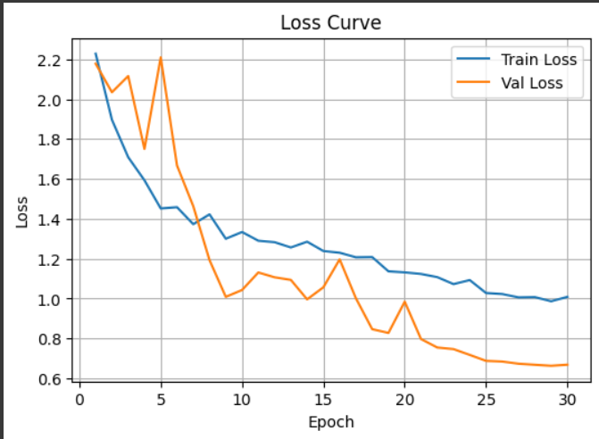
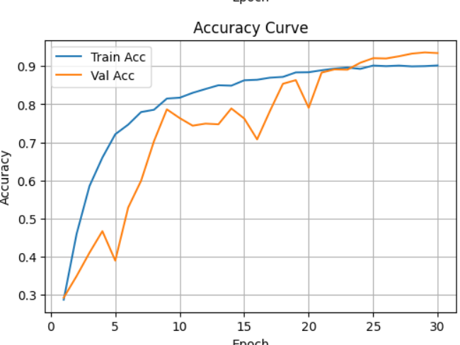

# CIFAR-10 이미지 분류 프로젝트

CIFAR-10 데이터셋을 사용한 이미지 분류 모델 개발 프로젝트입니다. 초기 실험부터 최종 최적화까지의 전체 과정을 담고 있습니다.

## 🎯 프로젝트 목표

- CIFAR-10 데이터셋으로 이미지 분류 모델 개발
- 다양한 최적화 기법 비교 및 성능 향상
- 실용적인 학습 속도와 높은 정확도 달성

## 📊 데이터셋 정보

**CIFAR-10 데이터셋**
- 10개 클래스: airplane, automobile, bird, cat, deer, dog, frog, horse, ship, truck
- 훈련 데이터: 50,000장 (클래스당 5,000장)
- 테스트 데이터: 10,000장 (클래스당 1,000장)
- 이미지 크기: 32×32 픽셀 (RGB)

## 🚀 모델 개발 과정

### 1단계: 초기 실험 (CIFAR10_초기학습.ipynb)

**실험한 접근법들:**
- Transfer Learning (ResNet18 + ImageNet 전이학습)
- From-scratch 학습 (작은 CNN)
- 성능 vs 속도 비교

**주요 발견사항:**
- ImageNet 전이학습이 높은 성능을 보였으나 학습 속도가 매우 느림
- 32×32 입력 유지 시 5-8배 빠른 학습 속도 달성

### 2단계: 속도 최적화 (CIFAR10_초기학습.ipynb)

**최적화 기법:**
- 32×32 입력 크기 유지 (224×224 → 32×32)
- 가벼운 SmallCNN 모델 사용
- Automatic Mixed Precision (AMP)
- 효율적인 DataLoader 설정

**성능 결과:**
- SmallCNN: Test Accuracy 83.59%
- 학습 속도 대폭 향상

### 3단계: 성능 향상 (CIFAR10_초기학습.ipynb)

**개선사항:**
- CIFAR-stem ResNet18 (7×7 conv → 3×3 conv, maxpool 제거)
- RandAugment(n=1) + Cutout(16) 데이터 증강
- Label Smoothing (0.1), Weight Decay (0.02)
- 더 큰 배치 사이즈 (384)

**성능 결과:**
- ResNet18 (개선): Test Accuracy 92.40%

### 4단계: 최종 최적화 (CIFAR10_최종학습.ipynb)

**최종 설정:**
- **옵티마이저**: SGD (momentum=0.9, nesterov=True, wd=5e-4)
- **데이터 증강**: RandAugment(num_ops=2) + Cutout(16)
- **정규화**: MixUp(α=0.2) + Label Smoothing(0.1)
- **스케줄러**: Cosine Annealing with Warmup
- **배치 크기**: 384
- **에포크**: 30 (Early Stopping)

**최종 성능:**
- **Test Accuracy: 92.72%**
- Top-1 정확도: 90.38% (실제 이미지 테스트)
- Top-5 정확도: 100.0%

## 🔧 주요 기술적 특징

### 모델 아키텍처
```python
# CIFAR-stem ResNet18
- conv1: 7×7 stride=2 → 3×3 stride=1 (CIFAR 최적화)
- maxpool 제거 → Identity
- 32×32 입력 크기 유지
```

### 데이터 증강 파이프라인
```python
train_transform = T.Compose([
    T.RandomCrop(32, padding=4),
    T.RandomHorizontalFlip(),
    T.RandAugment(num_ops=2, magnitude=7),
    T.ToTensor(),
    Cutout(size=16),
    T.Normalize(mean, std),
])
```

### 정규화 기법
- **MixUp**: 두 샘플을 선형으로 혼합하여 일반화 성능 향상
- **Label Smoothing**: 과신뢰 방지
- **Cutout**: 이미지 일부를 마스킹하여 강건성 증대

## 📈 성능 분석

### 클래스별 정확도
```
airplane:    100.0%    frog:       100.0%
automobile:   71.4%    horse:      100.0%
bird:         60.0%    ship:        92.9%
cat:         100.0%    truck:       90.0%
deer:        100.0%    dog:         81.8%
```

### 학습 곡선
- 안정적인 수렴 패턴
- 과적합 없이 일관된 성능 향상
- Early Stopping으로 최적 지점에서 학습 중단





## 🛠️ 사용 방법

### 환경 설정
```bash
# 필요한 패키지 설치
pip install torch torchvision matplotlib pandas numpy
```

### 모델 학습
```python
# 1. 초기 실험 실행
jupyter notebook CIFAR10_초기학습.ipynb

# 2. 최종 모델 학습
jupyter notebook CIFAR10_최종학습.ipynb
```

### 모델 평가
```python
# 저장된 모델 로드
model.load_state_dict(torch.load('best_cifar_sgd_mixup.pt'))

# 테스트 데이터셋 평가
test_loss, test_acc = eval_loader(test_loader)
print(f"Test Accuracy: {test_acc:.4f}")
```

## 📋 실험 결과 요약

| 모델 | 기법 | Test Accuracy | 특징 |
|------|------|---------------|------|
| ResNet18 (Transfer) | ImageNet 전이학습 | ~92% | 느린 학습 속도 |
| SmallCNN | From-scratch | 83.59% | 매우 빠른 학습 |
| CIFAR-ResNet18 | 기본 최적화 | 92.40% | 균형잡힌 성능 |
| **최종 모델** | **모든 기법 적용** | **92.72%** | **최고 성능** |

## 🎓 학습한 내용

1. **전이학습 vs From-scratch**: 상황에 따른 적절한 선택
2. **데이터 증강의 중요성**: RandAugment, Cutout, MixUp
3. **정규화 기법**: Label Smoothing, Weight Decay
4. **최적화 기법**: SGD vs AdamW, Cosine Scheduling
5. **실용적 고려사항**: 학습 속도 vs 성능의 트레이드오프
