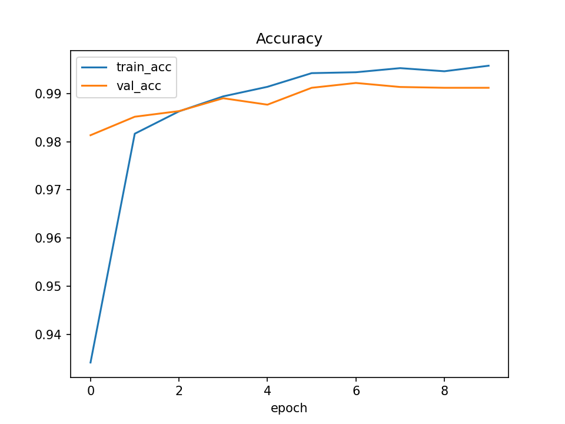
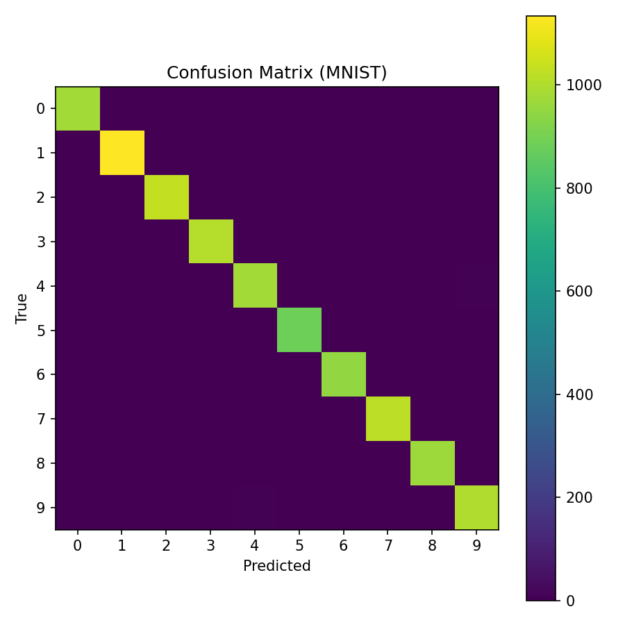
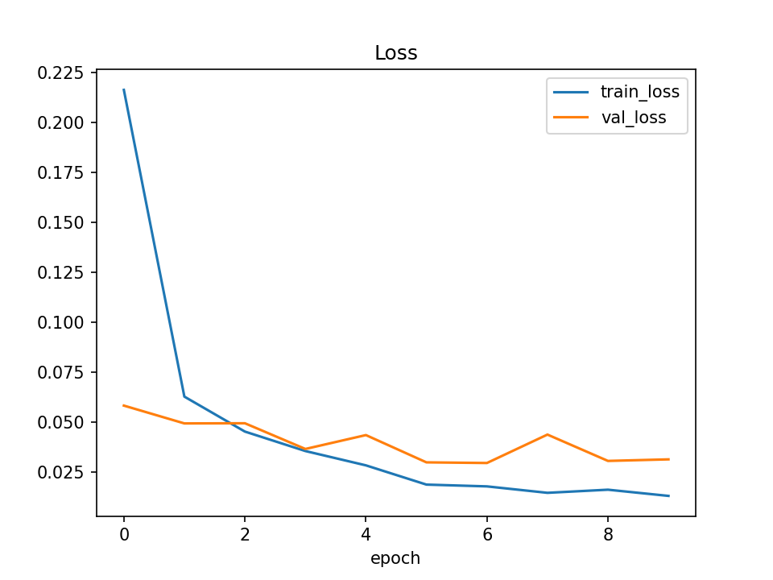
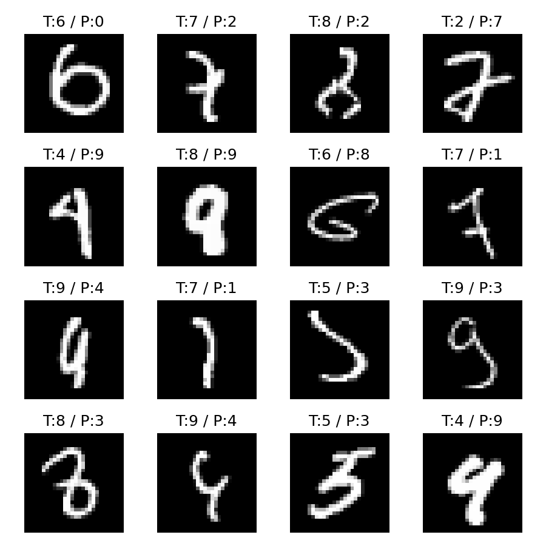
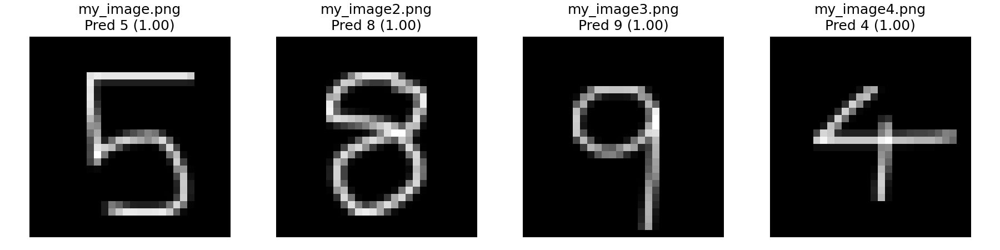

# MNIST Study & Inference Demo

간단한 CNN으로 MNIST 숫자(0–9)를 분류하고, **직접 그린 손글씨 이미지**를 전처리 후 모델에 입력하여 예측하는 데모를 제공합니다.  
목표는 **이론+기록 중심 학습**과 **재현 가능한 실험 환경**입니다.

---

## 전처리 파이프라인(요약)
- Grayscale → 자동 반전(옵션) → 타이트 크롭
- 20×20 리사이즈 후 28×28 패딩(중앙 정렬)
- 중심 이동(center of mass shift)로 정렬 보정
- 정규화: mean=0.1307, std=0.3081 (MNIST 표준)

## 모델 학습 결과 내용 정리 입니다.

### 예측 정확도

### 혼동 행렬

### 손실 곡선

### 오분류 사례

### 러닝 로그

---

## 데모 결과 내용 정리 입니다.

### 데모 결과 그리드

### 예측 csv 정리

---
